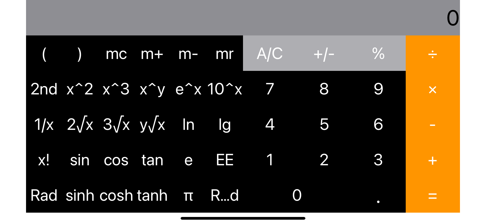
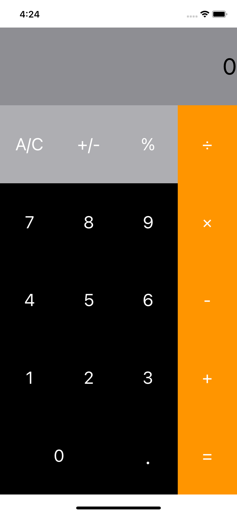

##iw01:简易计算器的实现
###实现结果界面展示
###横屏

###竖屏

##实现过程
###1、界面设计
主要运用各种stackView,并设置autolayout,使得不同规格的界面能正常运行。难点在于横屏竖屏显示的内容有所区别：横屏内容多于竖屏，因此先设计横屏
横屏先一个vertical stackView，将整个界面分为上下两个区域，最上面放一个label，显示结果，下面是各种按钮。

下面用一个Horizontal stackView,分为左右两个部分，设置为宽度相等，放置横屏独有的功能键和横竖屏都有的基本键。左/右区域按行划分，分为5行，设置高度相等，每行6个或4个按钮，用自动布局设置为宽度相等。

考虑竖屏（窄屏）不显示特殊功能键，将竖屏下左下区域的install选项置为false

这样在storyboard界面显示中，以iPhone11为模拟，横屏、竖屏可以如上图正常显示，但是，运行模拟器时，竖屏是正常的，当旋转为横屏时，会发生错乱：左右区域重叠

我的解决方案是在设置下边的constrains时，不（只）设置左右的view宽度相等，而是分别设置成下面整个区局的0.5倍，这样，运行起来也和上图一样了。

###2、功能实现
参考了视频中的实现方案。将操作符分为常数，一元操作符，二元操作符和特殊操作符。控制器将界面信息和按钮传进Calculator，Calculator进行处理，返回结果，再由viewController进行显示。

对于一元/常数操作符，只需要和视频中一样，对传入的结果直接计算出一个结果返回。而二元操作符和 ' = '的处理则需要完善。例如，用户在输入 5 + 3 = ,返回8，但是接着按'='，按理应当解析为 "+ 3 =",也就是继续上一步操作。因此需要设置变量保存最后一次输入的操作数(例子中的3)

我的方案是设置一个变量判断是否结果是纯数字，如果是，'='直接返回数字，不然，进行计算并且保存操作数以待下一次'='。这样能满足连续按'='，进行正确计算，不崩溃。或许有更好的设计方案。

此外计算器上的很多按键都从来没有用过，甚至没听说过。m+,m-,mr,mc是类似寄存器的功能，我这里单独实现。其他很多按键都可以转化为一元或二元操作符

π，e这里作常数处理了,可能不能进行一些计算。

对于Rand的理解，我是当成一个一元操作符,Rand(x)返回一个实数(浮点数)，范围在(0，x)之间

括号和2nd相对复杂，暂时没有实现